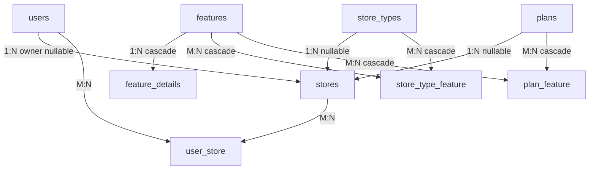
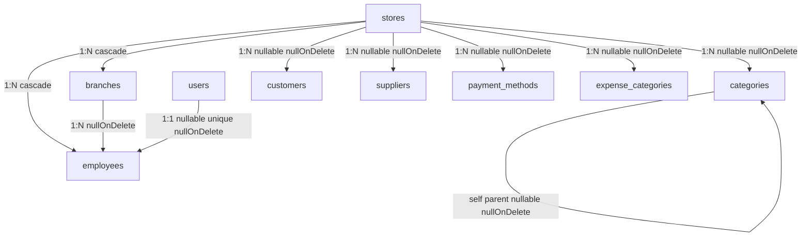
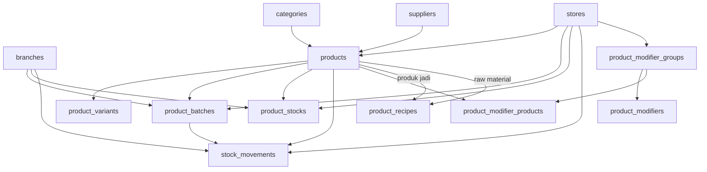
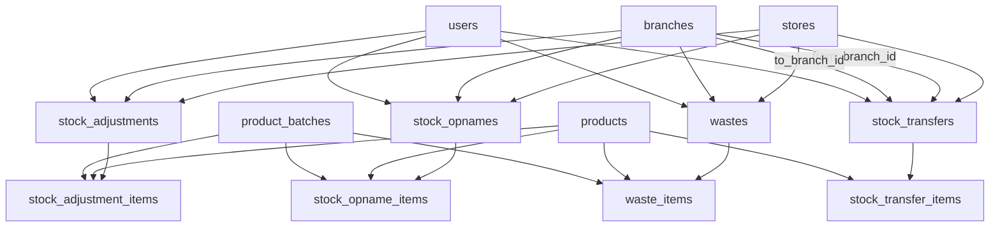
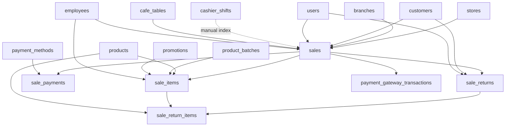
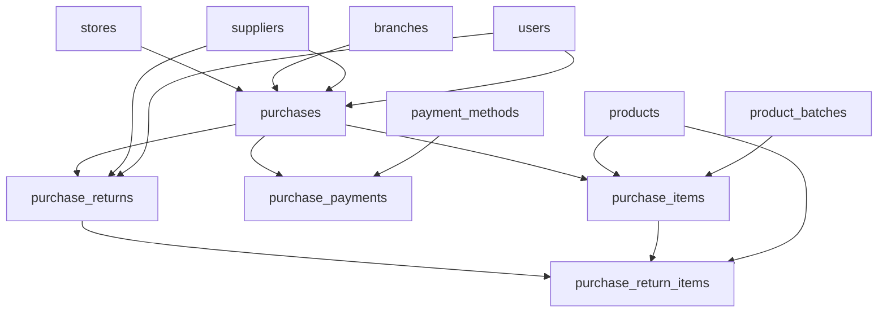

# 📚 DOKUMENTASI LENGKAP RELASI DATABASE SISTEM POS

## 🎯 Overview
Sistem ini menggunakan **100% relasi database** untuk menentukan fitur, akses, dan konfigurasi toko.
Tidak ada lagi ketergantungan pada JSON atau hardcoded values.

> **Sumber kebenaran utama:** struktur relasi wajib mengikuti file `database/migrations`. Jika ada method relasi di model yang berbeda dari foreign key migration, maka model harus disamakan ke migration, bukan sebaliknya.

**Prinsip Utama:**
- ✅ Semua data fitur ada di tabel `features` dan `feature_details`
- ✅ Store Type menentukan fitur mana yang relevan
- ✅ Plan menentukan limitasi akses fitur
- ✅ Store = intersection dari Store Type features + Plan features
- ✅ Employee terhubung ke Store dan Branch
- ✅ User terhubung ke Store via pivot table

---

## 🗺️ ERD - Entity Relationship Diagram

```
┌─────────────┐
│  features   │ ← Master list semua fitur sistem
├─────────────┤
│ id          │
│ code        │ (kitchen, stock, queue, dll)
│ label       │
│ description │
│ category    │ (pos, inventory, crm, finance, system)
│ is_active   │
│ sort_order  │
└─────────────┘
       │
       │ 1:N
       ▼
┌──────────────────┐
│ feature_details  │ ← Detail tambahan per fitur
├──────────────────┤
│ id               │
│ feature_id       │
│ code             │
│ label            │
│ description      │
│ sort_order       │
│ is_active        │
└──────────────────┘

        ┌──────────────────────────┐
        │                          │
        ▼                          ▼
┌─────────────────┐      ┌─────────────────┐
│ store_types     │      │     plans       │
├─────────────────┤      ├─────────────────┤
│ id              │      │ id              │
│ code            │      │ code            │
│ label           │      │ label           │
│ icon            │      │ description     │
│ description     │      │ max_users       │
│ order_types     │      │ max_branches    │
│ pos_behavior    │      │ price           │
│ is_active       │      │ trial_days      │
│ sort_order      │      │ is_active       │
└─────────────────┘      │ sort_order      │
        │                └─────────────────┘
        │ M:N                     │ M:N
        │ (store_type_feature)    │ (plan_feature)
        │                         │
        └────────┬────────────────┘
                 │
                 │ N:1
                 ▼
         ┌──────────────────┐
         │     stores       │ ← Toko/Tenant
         ├──────────────────┤
         │ id               │
         │ user_id          │ (owner utama, nullable)
         │ code             │
         │ name             │
         │ store_type_id    │ ← FK ke store_types
         │ logo             │
         │ currency         │
         │ decimal_places   │
         │ timezone         │
         │ tax_inclusive    │
         │ default_tax_rate │
         │ receipt_header   │
         │ receipt_footer   │
         │ phone            │
         │ email            │
         │ address          │
         │ is_active        │
         │ plan_id          │ ← FK ke plans
         │ plan_expires_at  │
         │ max_users        │ (override, nullable)
         │ max_branches     │ (override, nullable)
         └──────────────────┘
                │
                │ 1:N
                ▼
         ┌──────────────────┐
         │    branches      │ ← Cabang toko
         ├──────────────────┤
         │ id               │
         │ store_id         │ ← FK ke stores
         │ code             │
         │ name             │
         │ phone            │
         │ address          │
         │ is_active        │
         └──────────────────┘
                │
                │ 1:N
                ▼
         ┌──────────────────┐
         │   employees      │ ← Karyawan
         ├──────────────────┤
         │ id               │
         │ store_id         │ ← FK ke stores
         │ branch_id        │ ← FK ke branches
         │ user_id          │ ← FK ke users (nullable)
         │ employee_code    │
         │ name             │
         │ phone            │
         │ email            │
         │ position         │
         │ commission_type  │
         │ commission_value │
         │ status           │
         └──────────────────┘

┌──────────────────┐         ┌──────────────────┐
│     users        │ ◄─ M:N ─│   user_store     │ ── Pivot table
├──────────────────┤         ├──────────────────┤
│ id               │         │ user_id          │
│ name             │         │ store_id         │
│ email            │         └──────────────────┘
│ role             │
│ is_developer     │
└──────────────────┘
```

---

## 📋 TABEL 1: features (Master Fitur)

**Deskripsi:** Tabel master yang menyimpan semua fitur yang tersedia di sistem.

### Struktur:
| Column      | Type         | Deskripsi                          |
|-------------|--------------|-----------------------------------|
| id          | bigint(20)   | Primary key                        |
| code        | varchar(50)  | Kode unik fitur (kitchen, stock)   |
| label       | varchar(255) | Label untuk tampilan               |
| description | text         | Deskripsi fitur                    |
| category    | varchar(50)  | Kategori: pos, inventory, crm, dll |
| is_active   | tinyint(1)   | Status aktif                       |
| sort_order  | int(11)      | Urutan tampilan                    |

### Contoh Data:
```sql
INSERT INTO features VALUES
(1, 'kitchen', 'Kitchen Display', 'Layar dapur untuk pesanan', 'pos', 1, 10),
(2, 'stock', 'Manajemen Stok', 'Kelola stok barang', 'inventory', 1, 20),
(3, 'queue', 'Sistem Antrian', 'Antrian pelanggan', 'crm', 1, 30);
```

### Relasi:
- **1:N** dengan `feature_details`
- **M:N** dengan `store_types` via `store_type_feature`
- **M:N** dengan `plans` via `plan_feature`

### Cara Pakai di Code:
```php
// Ambil semua fitur aktif
$features = Feature::where('is_active', true)
    ->orderBy('sort_order')
    ->get();

// Ambil fitur berdasarkan kategori
$posFeatures = Feature::where('category', 'pos')
    ->where('is_active', true)
    ->get();
```

---

## 📋 TABEL 2: feature_details (Detail Fitur)

**Deskripsi:** Detail tambahan untuk konfigurasi fitur tertentu.

### Struktur:
| Column      | Type         | Deskripsi                    |
|-------------|--------------|------------------------------|
| id          | bigint(20)   | Primary key                  |
| feature_id  | bigint(20)   | FK ke features               |
| code        | varchar(50)  | Kode detail                  |
| label       | varchar(255) | Label detail                 |
| description | text         | Deskripsi detail             |
| sort_order  | int(11)      | Urutan                       |
| is_active   | tinyint(1)   | Status aktif                 |

### Contoh Use Case:
```sql
-- Feature: kitchen (id=1)
-- Detail: screen_layout
INSERT INTO feature_details VALUES
(1, 1, 'screen_layout', 'Layout Layar', 'Konfigurasi tampilan layar dapur', 1, 1),
(2, 1, 'auto_accept', 'Auto Accept Order', 'Otomatis terima pesanan', 2, 1);
```

### Cara Pakai di Code:
```php
// Ambil detail dari fitur kitchen
$kitchenFeature = Feature::where('code', 'kitchen')->first();
$details = $kitchenFeature->details()
    ->where('is_active', true)
    ->orderBy('sort_order')
    ->get();
```

---

## 📋 TABEL 3: store_types (Tipe Toko)

**Deskripsi:** Jenis-jenis toko (Retail, FnB, Service, dll) yang menentukan fitur relevan.

### Struktur:
| Column        | Type         | Deskripsi                         |
|---------------|--------------|-----------------------------------|
| id            | bigint(20)   | Primary key                       |
| code          | varchar(30)  | Kode: retail, fnb, service, dll   |
| label         | varchar(255) | Label tampilan                    |
| icon          | varchar(10)  | Emoji icon                        |
| description   | text         | Deskripsi tipe toko               |
| order_types   | json         | Jenis order yang didukung         |
| pos_behavior  | varchar(30)  | Behavior POS                      |
| is_active     | tinyint(1)   | Status aktif                      |
| sort_order    | int(11)      | Urutan tampilan                   |

### Contoh Data:
```sql
INSERT INTO store_types VALUES
(1, 'retail', 'Retail', '🏪', 'Toko, minimarket, grosir', 
 '[{"v":"takeaway","l":"Ambil"},{"v":"delivery","l":"Antar"}]', 
 'retail', 1, 1),
(2, 'fnb', 'FnB / Cafe', '☕', 'Restoran, cafe, warung',
 '[{"v":"dine_in","l":"Dine In"},{"v":"takeaway","l":"Takeaway"}]',
 'fnb', 1, 2);
```

### Relasi:
- **1:N** dengan `stores`
- **M:N** dengan `features` via `store_type_feature`

### Cara Pakai di Code:
```php
// Ambil store type dengan features-nya
$storeType = StoreType::with('features')
    ->where('code', 'fnb')
    ->first();

// Cek apakah store type punya fitur tertentu
$hasKitchen = $storeType->features()
    ->where('features.code', 'kitchen')
    ->exists(); // true untuk FnB
```

---

## 📋 TABEL 4: plans (Paket Langganan)

**Deskripsi:** Paket langganan yang menentukan limitasi dan fitur yang boleh diakses.

### Struktur:
| Column       | Type           | Deskripsi                  |
|--------------|----------------|----------------------------|
| id           | bigint(20)     | Primary key                |
| code         | varchar(30)    | Kode: free, basic, pro     |
| label        | varchar(255)   | Label tampilan             |
| description  | text           | Deskripsi paket            |
| max_users    | int(11)        | Maks jumlah user           |
| max_branches | int(11)        | Maks jumlah cabang         |
| price        | decimal(15,2)  | Harga per bulan            |
| trial_days   | int(11)        | Hari trial                 |
| is_active    | tinyint(1)     | Status aktif               |
| sort_order   | int(11)        | Urutan tampilan            |

### Contoh Data:
```sql
INSERT INTO plans VALUES
(1, 'free', 'Free', 'Paket gratis', 1, 1, 0, 0, 1, 1),
(2, 'basic', 'Basic', 'Paket dasar', 5, 3, 99000, 7, 1, 2),
(3, 'pro', 'Pro', 'Paket profesional', 999, 999, 299000, 14, 1, 3);
```

### Relasi:
- **1:N** dengan `stores`
- **M:N** dengan `features` via `plan_feature`

### Cara Pakai di Code:
```php
// Ambil plan dengan features-nya
$plan = Plan::with('features')->where('code', 'basic')->first();

// Cek fitur yang diizinkan plan
$featureCodes = $plan->featureCodes(); // ['stock', 'purchase', 'kitchen', ...]

// Cek apakah plan mengizinkan fitur tertentu
$allowsKitchen = $plan->features()
    ->where('features.code', 'kitchen')
    ->exists();
```

---

## 📋 TABEL 5: store_type_feature (Pivot)

**Deskripsi:** Tabel pivot yang menghubungkan store_types dengan features.

### Struktur:
| Column        | Type       | Deskripsi          |
|---------------|------------|--------------------|
| id            | bigint(20) | Primary key        |
| store_type_id | bigint(20) | FK ke store_types  |
| feature_id    | bigint(20) | FK ke features     |

### Contoh Data:
```sql
-- FnB (id=2) punya fitur kitchen (id=1), stock (id=2), queue (id=3)
INSERT INTO store_type_feature VALUES
(1, 2, 1),  -- FnB → kitchen
(2, 2, 2),  -- FnB → stock
(3, 1, 2);  -- Retail → stock (tapi tidak ada kitchen)
```

### Cara Pakai di Code:
```php
// Cek fitur yang dimiliki store type FnB
$fnbType = StoreType::where('code', 'fnb')->first();
$fnbFeatures = $fnbType->features; // Collection of Feature models

// Attach fitur baru ke store type
$fnbType->features()->attach($featureId);

// Detach fitur
$fnbType->features()->detach($featureId);

// Sync semua fitur (replace existing)
$fnbType->features()->sync([1, 2, 3]);
```

---

## 📋 TABEL 6: plan_feature (Pivot)

**Deskripsi:** Tabel pivot yang menghubungkan plans dengan features.

### Struktur:
| Column     | Type       | Deskripsi       |
|------------|------------|-----------------|
| id         | bigint(20) | Primary key     |
| plan_id    | bigint(20) | FK ke plans     |
| feature_id | bigint(20) | FK ke features  |

### Contoh Data:
```sql
-- Plan Basic (id=2) punya fitur stock (id=2), kitchen (id=1)
-- Plan Free (id=1) hanya punya stock (id=2)
INSERT INTO plan_feature VALUES
(1, 1, 2),  -- Free → stock
(2, 2, 1),  -- Basic → kitchen
(3, 2, 2),  -- Basic → stock
(4, 3, 1),  -- Pro → kitchen
(5, 3, 2);  -- Pro → stock
```

### Cara Pakai di Code:
```php
// Cek fitur yang diizinkan plan Basic
$basicPlan = Plan::where('code', 'basic')->first();
$basicFeatures = $basicPlan->features; // Collection of Feature models

// Attach fitur baru ke plan
$basicPlan->features()->attach($featureId);

// Detach fitur
$basicPlan->features()->detach($featureId);

// Sync semua fitur (replace existing)
$basicPlan->features()->sync([1, 2, 3, 4]);
```

---

## 📋 TABEL 7: stores (Toko/Tenant)

**Deskripsi:** Tabel utama untuk data toko/tenant. Setiap toko punya store_type dan plan.

### Struktur:
| Column           | Type            | Deskripsi                           |
|------------------|-----------------|-------------------------------------|
| id               | bigint(20)      | Primary key                         |
| user_id          | bigint(20)      | FK ke users (owner utama, nullable) |
| code             | varchar(50)     | Kode unik toko                      |
| name             | varchar(255)    | Nama toko                           |
| store_type_id    | bigint(20)      | FK ke store_types                   |
| logo             | varchar(255)    | Path logo                           |
| currency         | varchar(10)     | Mata uang (IDR, USD)                |
| decimal_places   | tinyint(3)      | Desimal harga                       |
| timezone         | varchar(50)     | Timezone                            |
| tax_inclusive    | tinyint(1)      | Pajak sudah termasuk?               |
| default_tax_rate | decimal(5,2)    | Persentase pajak default            |
| receipt_header   | text            | Header struk                        |
| receipt_footer   | text            | Footer struk                        |
| phone            | varchar(30)     | Telepon toko                        |
| email            | varchar(255)    | Email toko                          |
| address          | text            | Alamat toko                         |
| is_active        | tinyint(1)      | Status aktif                        |
| plan_id          | bigint(20)      | FK ke plans                         |
| plan_expires_at  | date            | Tanggal expired plan                |
| max_users        | smallint(5)     | Override maks user (nullable)       |
| max_branches     | smallint(5)     | Override maks cabang (nullable)     |

### Relasi:
- **N:1** dengan `store_types`
- **N:1** dengan `plans`
- **1:N** dengan `branches`
- **1:N** dengan `employees`
- **M:N** dengan `users` via `user_store`

### Cara Pakai di Code:
```php
// Ambil store dengan relasi lengkap
$store = Store::with(['storeType.features', 'planModel.features', 'branches', 'employees'])
    ->find($storeId);

// Cek fitur yang aktif di toko (intersection store_type + plan)
$hasKitchen = $store->hasFeature('kitchen');
// Returns true jika:
// 1. Store type punya feature kitchen
// 2. Plan mengizinkan feature kitchen

// Cek POS mode
$isFnb = $store->hasPosMode('fnb');
// Returns true jika store_type.code = 'fnb'

// Ambil config plan aktif
$planConfig = $store->activePlanConfig();
// Returns: ['label' => 'Basic', 'max_users' => 5, 'features' => [...]]

// Cek limit
$canAddUser = $store->canAddUser(); // Cek apakah bisa tambah user
$canAddBranch = $store->canAddBranch(); // Cek apakah bisa tambah cabang
```

---

## 📋 TABEL 8: branches (Cabang Toko)

**Deskripsi:** Cabang-cabang dari sebuah toko. Setiap toko bisa punya banyak cabang.

### Struktur:
| Column    | Type         | Deskripsi           |
|-----------|--------------|---------------------|
| id        | bigint(20)   | Primary key         |
| store_id  | bigint(20)   | FK ke stores        |
| code      | varchar(50)  | Kode unik cabang    |
| name      | varchar(255) | Nama cabang         |
| phone     | varchar(30)  | Telepon cabang      |
| address   | text         | Alamat cabang       |
| is_active | tinyint(1)   | Status aktif        |

### Relasi:
- **N:1** dengan `stores`
- **1:N** dengan `employees`
- **1:N** dengan `sales` (transaksi)
- **1:N** dengan `purchases` (pembelian)

### Cara Pakai di Code:
```php
// Ambil semua cabang dari toko
$branches = Branch::where('store_id', $storeId)
    ->where('is_active', true)
    ->orderBy('name')
    ->get();

// Ambil cabang dengan employee count
$branch = Branch::withCount('employees')
    ->find($branchId);

// Cek apakah store bisa tambah cabang baru
$store = Store::find($storeId);
if ($store->canAddBranch()) {
    // Buat cabang baru
    $branch = Branch::create([
        'store_id' => $storeId,
        'code' => 'CAB-02',
        'name' => 'Cabang Sudirman',
        'is_active' => true,
    ]);
}
```

---

## 📋 TABEL 9: employees (Karyawan)

**Deskripsi:** Data karyawan yang bekerja di toko dan cabang tertentu.

### Struktur:
| Column           | Type          | Deskripsi                       |
|------------------|---------------|---------------------------------|
| id               | bigint(20)    | Primary key                     |
| store_id         | bigint(20)    | FK ke stores                    |
| branch_id        | bigint(20)    | FK ke branches                  |
| user_id          | bigint(20)    | FK ke users (nullable)          |
| employee_code    | varchar(50)   | Kode karyawan                   |
| name             | varchar(255)  | Nama karyawan                   |
| phone            | varchar(20)   | Telepon                         |
| email            | varchar(255)  | Email                           |
| position         | varchar(100)  | Jabatan                         |
| commission_type  | varchar(20)   | Tipe komisi (percentage/fixed)  |
| commission_value | decimal(10,2) | Nilai komisi                    |
| status           | varchar(20)   | Status: active/inactive         |

### Relasi:
- **N:1** dengan `stores`
- **N:1** dengan `branches`
- **N:1** dengan `users` (nullable - tidak semua employee punya akun user)

### Cara Pakai di Code:
```php
// Ambil employee dengan relasi
$employee = Employee::with(['store', 'branch', 'user'])
    ->find($employeeId);

// Ambil employee dari branch tertentu
$employees = Employee::where('branch_id', $branchId)
    ->where('status', 'active')
    ->get();

// Cek apakah employee punya akun user
if ($employee->user) {
    echo "Employee ini punya akun: " . $employee->user->email;
} else {
    echo "Employee ini belum punya akun user";
}

// Buat employee baru
$employee = Employee::create([
    'store_id' => $storeId,
    'branch_id' => $branchId,
    'employee_code' => 'EMP-001',
    'name' => 'John Doe',
    'position' => 'Kasir',
    'status' => 'active',
]);
```

---

## 📋 TABEL 10: users (User/Akun Login)

**Deskripsi:** Akun user yang bisa login ke sistem. User bisa punya akses ke banyak toko.

### Struktur:
| Column              | Type         | Deskripsi                  |
|---------------------|--------------|----------------------------|
| id                  | bigint(20)   | Primary key                |
| name                | varchar(255) | Nama user                  |
| email               | varchar(255) | Email (unique)             |
| role                | varchar(20)  | Role global (deprecated)   |
| is_developer        | tinyint(1)   | Akses developer/super?     |
| email_verified_at   | timestamp    | Verifikasi email           |
| password            | varchar(255) | Hashed password            |
| remember_token      | varchar(100) | Token remember me          |

### Relasi:
- **M:N** dengan `stores` via `user_store` (satu user bisa akses banyak toko)
- **1:N** dengan `employees` (nullable - tidak semua user adalah employee)

### Cara Pakai di Code:
```php
// Ambil user dengan stores yang bisa diakses
$user = User::with('stores')->find($userId);

// Cek apakah user punya akses ke toko tertentu
$hasAccess = $user->stores()->where('stores.id', $storeId)->exists();

// Ambil semua toko yang bisa diakses user
$userStores = $user->stores; // Collection of Store models

// Assign user ke toko (buat jadi owner/staff)
$user->stores()->attach($storeId); // Tambah akses
$user->stores()->detach($storeId); // Cabut akses
$user->stores()->sync([$store1, $store2]); // Replace semua akses

// Cek apakah user adalah developer
if ($user->is_developer) {
    // User ini bisa akses semua toko dan fitur developer
}
```

---

## 📋 TABEL 11: user_store (Pivot User-Store)

**Deskripsi:** Tabel pivot yang menghubungkan users dengan stores (akses multi-toko).

### Struktur:
| Column   | Type       | Deskripsi      |
|----------|------------|----------------|
| user_id  | bigint(20) | FK ke users    |
| store_id | bigint(20) | FK ke stores   |

### Cara Pakai di Code:
```php
// Cek toko yang bisa diakses user
$userStores = DB::table('user_store')
    ->where('user_id', $userId)
    ->pluck('store_id');

// Atau pakai relasi
$userStores = User::find($userId)->stores;

// Cek user yang punya akses ke toko tertentu
$storeUsers = Store::find($storeId)->users;

// Tambah akses user ke toko
DB::table('user_store')->insert([
    'user_id' => $userId,
    'store_id' => $storeId,
]);

// Atau pakai relasi
$user->stores()->attach($storeId);
```

---

## 🔄 FLOW PENGECEKAN FITUR

### Alur Lengkap: "Apakah Toko Bisa Pakai Fitur Kitchen?"

```php
// 1. Load toko dengan relasi yang diperlukan
$store = Store::with(['storeType.features', 'planModel.features'])
    ->find($storeId);

// 2. Cek store type (FnB, Retail, dll)
$storeType = $store->getRelation('storeType');
// Output: StoreType { code: 'fnb', label: 'FnB / Cafe' }

// 3. Cek apakah store type punya fitur kitchen
$storeTypeHasKitchen = $storeType->features()
    ->where('features.code', 'kitchen')
    ->where('features.is_active', true)
    ->exists();
// Output: true (FnB punya kitchen) atau false (Retail tidak punya)

// 4. Cek plan (Free, Basic, Pro)
$plan = $store->getRelation('planModel');
// Output: Plan { code: 'basic', label: 'Basic' }

// 5. Cek apakah plan mengizinkan kitchen
$planAllowsKitchen = $plan->features()
    ->where('features.code', 'kitchen')
    ->where('features.is_active', true)
    ->exists();
// Output: true (Basic/Pro punya kitchen) atau false (Free tidak punya)

// 6. Hasil akhir (intersection)
$canUseKitchen = $storeTypeHasKitchen && $planAllowsKitchen;
// Returns: true hanya jika KEDUANYA true

// 7. Atau pakai helper method
$canUseKitchen = $store->hasFeature('kitchen');
// Shortcut yang melakukan pengecekan di atas
```

---

## 📊 CONTOH SKENARIO LENGKAP

### Skenario 1: Toko FnB dengan Plan Basic

```php
// Data:
// - Store: "Cafe Kita" (store_type: fnb, plan: basic)
// - Store Type FnB punya: kitchen, stock, table, modifier
// - Plan Basic punya: kitchen, stock, queue

// Cek fitur yang aktif
$store->hasFeature('kitchen');   // ✅ true  (ada di FnB & Basic)
$store->hasFeature('stock');     // ✅ true  (ada di FnB & Basic)
$store->hasFeature('table');     // ❌ false (ada di FnB, tapi Basic tidak punya)
$store->hasFeature('modifier');  // ❌ false (ada di FnB, tapi Basic tidak punya)
$store->hasFeature('queue');     // ❌ false (Basic punya, tapi FnB tidak punya)

// POS Mode
$store->hasPosMode('fnb');       // ✅ true
$store->hasPosMode('retail');    // ❌ false
```

### Skenario 2: Toko Retail dengan Plan Pro

```php
// Data:
// - Store: "Toko Maju" (store_type: retail, plan: pro)
// - Store Type Retail punya: stock, purchase, batch, expiry
// - Plan Pro punya: SEMUA FITUR (wildcard)

// Cek fitur yang aktif
$store->hasFeature('stock');     // ✅ true  (ada di Retail & Pro)
$store->hasFeature('purchase');  // ✅ true  (ada di Retail & Pro)
$store->hasFeature('kitchen');   // ❌ false (Pro punya, tapi Retail tidak support)
$store->hasFeature('table');     // ❌ false (Pro punya, tapi Retail tidak support)

// POS Mode
$store->hasPosMode('retail');    // ✅ true
$store->hasPosMode('fnb');       // ❌ false
```

### Skenario 3: Upgrade Plan dari Free ke Basic

```php
// Sebelum upgrade
$store->plan_id = 1; // Free
$store->hasFeature('kitchen');   // ❌ false (Free tidak punya kitchen)

// Upgrade plan
$store->update(['plan_id' => 2]); // Basic

// Setelah upgrade
$store->refresh(); // Reload dari database
$store = Store::with(['storeType.features', 'planModel.features'])
    ->find($store->id);

$store->hasFeature('kitchen');   // ✅ true (Basic punya kitchen)
```

---

## 🔍 CARA CEK YANG SALAH DAN BENAR

### ❌ SALAH - Pakai JSON modules (sudah dihapus)

```php
// ❌ JANGAN PAKAI INI LAGI
$features = $store->modules['features'] ?? [];
if (in_array('kitchen', $features)) {
    // ...
}

// ❌ Field modules sudah tidak ada
$store->modules; // null atau error
```

### ✅ BENAR - Pakai relasi database

```php
// ✅ Pakai helper method
if ($store->hasFeature('kitchen')) {
    // Kitchen tersedia
}

// ✅ Atau query relasi langsung
$hasKitchen = $store->storeType()
    ->first()
    ->features()
    ->where('features.code', 'kitchen')
    ->exists();

// ✅ Ambil semua fitur aktif
$store = Store::with(['storeType.features', 'planModel.features'])
    ->find($storeId);

$storeTypeFeatures = $store->getRelation('storeType')->features;
$planFeatures = $store->getRelation('planModel')->features;

// Intersection = fitur yang aktif
$activeFeatures = $storeTypeFeatures->filter(function($f) use ($planFeatures) {
    return $planFeatures->contains('code', $f->code);
});
```

---

## 🛠️ CARA MENGELOLA FITUR (Developer/Admin)

### Menambah Fitur Baru ke Sistem

```php
// 1. Insert fitur baru ke tabel features
$feature = Feature::create([
    'code' => 'loyalty_program',
    'label' => 'Program Loyalitas',
    'description' => 'Sistem poin dan reward pelanggan',
    'category' => 'crm',
    'is_active' => true,
    'sort_order' => 100,
]);

// 2. Assign ke store types yang relevan
$retailType = StoreType::where('code', 'retail')->first();
$fnbType = StoreType::where('code', 'fnb')->first();

$retailType->features()->attach($feature->id);
$fnbType->features()->attach($feature->id);

// 3. Assign ke plans yang relevan
$basicPlan = Plan::where('code', 'basic')->first();
$proPlan = Plan::where('code', 'pro')->first();

$basicPlan->features()->attach($feature->id);
$proPlan->features()->attach($feature->id);

// 4. Sekarang toko dengan Retail/FnB + Basic/Pro bisa pakai loyalty_program
```

### Mengubah Fitur Store Type

```php
// Ambil store type FnB
$fnbType = StoreType::where('code', 'fnb')->first();

// Lihat fitur yang sudah ada
$existingFeatures = $fnbType->features->pluck('code');
// ['kitchen', 'stock', 'table', 'modifier']

// Tambah fitur baru (queue)
$queueFeature = Feature::where('code', 'queue')->first();
$fnbType->features()->attach($queueFeature->id);

// Hapus fitur (modifier)
$modifierFeature = Feature::where('code', 'modifier')->first();
$fnbType->features()->detach($modifierFeature->id);

// Atau ganti semua sekaligus (sync)
$newFeatureIds = Feature::whereIn('code', ['kitchen', 'stock', 'table', 'queue'])
    ->pluck('id');
$fnbType->features()->sync($newFeatureIds);
```

### Mengubah Fitur Plan

```php
// Ambil plan Basic
$basicPlan = Plan::where('code', 'basic')->first();

// Tambah fitur membership
$membershipFeature = Feature::where('code', 'membership')->first();
$basicPlan->features()->attach($membershipFeature->id);

// Hapus fitur kitchen (downgrade)
$kitchenFeature = Feature::where('code', 'kitchen')->first();
$basicPlan->features()->detach($kitchenFeature->id);

// Sync multiple features
$featureIds = Feature::whereIn('code', ['stock', 'purchase', 'report'])
    ->pluck('id');
$basicPlan->features()->sync($featureIds);
```

---

## 🚀 QUERY OPTIMIZATION

### Eager Loading (Hindari N+1 Query)

```php
// ❌ BURUK - N+1 Query
$stores = Store::all();
foreach ($stores as $store) {
    echo $store->storeType->label; // Query per iterasi
    echo $store->planModel->label;  // Query per iterasi
}

// ✅ BAIK - Eager Loading
$stores = Store::with(['storeType', 'planModel'])->get();
foreach ($stores as $store) {
    echo $store->storeType->label; // Sudah di-load
    echo $store->planModel->label;  // Sudah di-load
}

// ✅ LEBIH BAIK - Nested Eager Loading
$stores = Store::with([
    'storeType.features',
    'planModel.features',
    'branches.employees',
    'users'
])->get();
```

### Lazy Eager Loading (Load Setelah Query)

```php
$store = Store::find($storeId);

// Load relasi setelah query
$store->load(['storeType.features', 'planModel.features']);

// Sekarang bisa akses tanpa query lagi
$features = $store->storeType->features;
```

### Menggunakan withCount

```php
// Hitung jumlah relasi tanpa load semua data
$stores = Store::withCount(['branches', 'employees', 'users'])
    ->get();

foreach ($stores as $store) {
    echo "Cabang: " . $store->branches_count;
    echo "Karyawan: " . $store->employees_count;
    echo "Users: " . $store->users_count;
}
```

---

## 📝 CHECKLIST IMPLEMENTASI

Gunakan checklist ini untuk memastikan kode Anda mengikuti arsitektur baru:

### ✅ Do (Yang Harus Dilakukan)

- [x] Gunakan `$store->hasFeature('feature_code')` untuk cek fitur
- [x] Gunakan `$store->hasPosMode('mode')` untuk cek POS mode
- [x] Load relasi dengan `with(['storeType.features', 'planModel.features'])`
- [x] Gunakan `getRelation('storeType')` untuk bypass accessor
- [x] Query features dari pivot table: `store_type_feature` & `plan_feature`
- [x] Tambah fitur baru via insert ke tabel `features`
- [x] Assign fitur via `$storeType->features()->attach($featureId)`
- [x] Cek intersection store type features + plan features

### ❌ Don't (Yang JANGAN Dilakukan)

- [ ] ~~Jangan akses `$store->modules`~~ (sudah dihapus)
- [ ] ~~Jangan hardcode array features di PHP~~ (pakai database)
- [ ] ~~Jangan pakai `$store->storeType->id`~~ (gunakan `getRelation()`)
- [ ] ~~Jangan lupa eager loading~~ (hindari N+1)
- [ ] ~~Jangan query di loop~~ (pakai `withCount` atau eager load)

---

## 🐛 TROUBLESHOOTING

### Error: "Attempt to read property on string"

**Penyebab:** Accessor conflict antara `getStoreTypeAttribute()` dan relasi `storeType()`.

**Solusi:**
```php
// ❌ Salah
$storeType = $store->storeType; // Returns string dari accessor

// ✅ Benar
$storeType = $store->getRelation('storeType'); // Returns Model object
```

### Fitur Tidak Muncul Padahal Sudah Diset

**Cek:**
1. Apakah fitur aktif? `features.is_active = 1`
2. Apakah ada di `store_type_feature`?
3. Apakah ada di `plan_feature`?
4. Apakah sudah eager load relasi?

**Debug:**
```php
$store = Store::with(['storeType.features', 'planModel.features'])
    ->find($storeId);

// Cek store type features
dd($store->getRelation('storeType')->features->pluck('code'));

// Cek plan features
dd($store->getRelation('planModel')->features->pluck('code'));
```

### Performance Lambat

**Solusi:**
```php
// Gunakan eager loading
Store::with(['storeType.features', 'planModel.features'])->get();

// Atau pakai withCount untuk menghitung saja
Store::withCount('branches')->get();

// Cache hasil query yang sering dipakai
$features = Cache::remember('store_features_' . $storeId, 3600, function() use ($storeId) {
    return Store::with(['storeType.features', 'planModel.features'])
        ->find($storeId)
        ->getActiveFeatures();
});
```

---

## 📚 REFERENSI MODEL METHODS

### Store Model

```php
// Cek fitur
$store->hasFeature('kitchen');              // bool
$store->planAllowsFeature('kitchen');       // bool
$store->hasPosMode('fnb');                  // bool

// Config
$store->activePlanConfig();                 // array
$store->effectiveMaxUsers();                // int
$store->effectiveMaxBranches();             // int

// Limitasi
$store->canAddUser();                       // bool
$store->canAddBranch();                     // bool
$store->isPlanExpired();                    // bool
$store->effectivePlanCode();                // string

// Relasi (gunakan getRelation untuk bypass accessor)
$store->getRelation('storeType');           // StoreType model
$store->getRelation('planModel');           // Plan model
$store->branches;                           // Collection<Branch>
$store->employees;                          // Collection<Employee>
$store->users;                              // Collection<User>
```

### StoreType Model

```php
// Relasi
$storeType->stores;                         // Collection<Store>
$storeType->features;                       // Collection<Feature>

// Methods
$storeType->featureCodes();                 // array ['kitchen', 'stock', ...]
$storeType->featureList();                  // array ['kitchen' => 'Kitchen Display', ...]

// Static
StoreType::active();                        // array
StoreType::codes();                         // array ['retail', 'fnb', ...]
```

### Plan Model

```php
// Relasi
$plan->stores;                              // Collection<Store>
$plan->features;                            // Collection<Feature>

// Methods
$plan->featureCodes();                      // array ['kitchen', 'stock', ...]
```

### Feature Model

```php
// Relasi
$feature->details;                          // Collection<FeatureDetail>
$feature->storeTypes;                       // Collection<StoreType>
$feature->plans;                            // Collection<Plan>

// Scope
Feature::active();                          // Query builder
Feature::byCategory('pos');                 // Query builder
```

---

## 🧭 PETA RELASI LENGKAP BERDASARKAN MIGRATION

Bagian ini merangkum alur relasi dari seluruh migration. Gunakan bagian ini ketika mengecek apakah model Eloquent sudah benar.

**Aturan membaca tabel:**

| Istilah | Arti |
|---------|------|
| `required` | Kolom FK tidak nullable, data induk wajib ada |
| `nullable` | Kolom FK boleh kosong |
| `cascade` | Jika induk dihapus, data anak ikut terhapus |
| `null` | Jika induk dihapus, FK di anak menjadi `NULL` |
| `default` | Tidak ada aksi delete khusus di migration |
| `manual index` | Kolom dibuat sebagai `unsignedBigInteger()->index()`, bukan FK database |

### 1. Relasi Tenant, Owner, Plan, dan Fitur



| Tabel anak | Kolom FK | Ke tabel | Nullable | On delete | Catatan model yang benar |
|------------|----------|----------|----------|-----------|---------------------------|
| `stores` | `user_id` | `users.id` | nullable | default | `Store::owner()` pakai `belongsTo(User::class, 'user_id')` |
| `stores` | `store_type_id` | `store_types.id` | nullable | default | `Store::storeType()` pakai `belongsTo(StoreType::class, 'store_type_id')` |
| `stores` | `plan_id` | `plans.id` | nullable | default | `Store::planModel()` pakai `belongsTo(Plan::class, 'plan_id')`; nama `plan` dipakai accessor code |
| `user_store` | `user_id` | `users.id` | required | cascade | Pivot M:N `User` ↔ `Store` |
| `user_store` | `store_id` | `stores.id` | required | cascade | Unique `user_id + store_id` |
| `feature_details` | `feature_id` | `features.id` | required | cascade | `Feature::details()` / `FeatureDetail::feature()` |
| `store_type_feature` | `store_type_id` | `store_types.id` | required | cascade | Pivot M:N `StoreType` ↔ `Feature` |
| `store_type_feature` | `feature_id` | `features.id` | required | cascade | Unique `store_type_id + feature_id` |
| `plan_feature` | `plan_id` | `plans.id` | required | cascade | Pivot M:N `Plan` ↔ `Feature` |
| `plan_feature` | `feature_id` | `features.id` | required | cascade | Unique `plan_id + feature_id` |

**Alur akses fitur yang benar:**

1. `stores.store_type_id` menentukan tipe toko (`store_types`).
2. `store_type_feature` menentukan fitur yang relevan untuk tipe toko tersebut.
3. `stores.plan_id` menentukan paket langganan (`plans`).
4. `plan_feature` menentukan fitur yang diizinkan oleh paket.
5. Fitur yang benar-benar bisa dipakai toko adalah irisan dari fitur `store_type` dan fitur `plan`.
6. Detail subfitur/konfigurasi tambahan dibaca dari `feature_details` melalui `features.id`.

### 2. Relasi Struktur Operasional Store



| Tabel anak | Kolom FK | Ke tabel | Nullable | On delete | Catatan |
|------------|----------|----------|----------|-----------|---------|
| `branches` | `store_id` | `stores.id` | required | cascade | Cabang selalu milik store |
| `employees` | `store_id` | `stores.id` | required | cascade | Karyawan wajib punya store |
| `employees` | `branch_id` | `branches.id` | nullable | null | Karyawan boleh lintas cabang/tanpa cabang tetap |
| `employees` | `user_id` | `users.id` | nullable unique | null | Satu akun login maksimal untuk satu employee |
| `categories` | `store_id` | `stores.id` | nullable | null | Kategori bisa global jika `store_id` null |
| `categories` | `parent_id` | `categories.id` | nullable | null | Hierarki kategori parent-child |
| `customers` | `store_id` | `stores.id` | nullable | null | Customer bisa global jika `store_id` null |
| `suppliers` | `store_id` | `stores.id` | nullable | null | Supplier bisa global jika `store_id` null |
| `payment_methods` | `store_id` | `stores.id` | nullable | null | Metode pembayaran bisa global jika `store_id` null |
| `expense_categories` | `store_id` | `stores.id` | nullable | null | Unique `store_id + code` |

### 3. Relasi Produk, Stok, Modifier, dan Resep



| Tabel anak | Kolom FK | Ke tabel | Nullable | On delete | Catatan |
|------------|----------|----------|----------|-----------|---------|
| `products` | `store_id` | `stores.id` | nullable | null | Produk bisa global jika `store_id` null |
| `products` | `category_id` | `categories.id` | nullable | null | Produk boleh tanpa kategori |
| `products` | `supplier_id` | `suppliers.id` | nullable | null | Produk boleh tanpa supplier |
| `product_variants` | `product_id` | `products.id` | required | cascade | Varian ikut terhapus jika produk dihapus |
| `product_batches` | `product_id` | `products.id` | required | cascade | Batch stok per produk |
| `product_batches` | `store_id` | `stores.id` | nullable | null | Batch bisa terkait store |
| `product_batches` | `branch_id` | `branches.id` | nullable | null | Batch bisa terkait branch |
| `product_stocks` | `product_id` | `products.id` | required | cascade | Stok per produk/store/branch |
| `product_stocks` | `store_id` | `stores.id` | nullable | null | Unique `product_id + store_id + branch_id` |
| `product_stocks` | `branch_id` | `branches.id` | nullable | null | Index `store_id + branch_id` |
| `stock_movements` | `product_id` | `products.id` | required | cascade | Histori mutasi stok |
| `stock_movements` | `product_batch_id` | `product_batches.id` | nullable | null | Mutasi bisa tanpa batch |
| `stock_movements` | `store_id` | `stores.id` | nullable | null | Scope tenant |
| `stock_movements` | `branch_id` | `branches.id` | nullable | null | Scope cabang |
| `stock_movements` | `reference_type/reference_id` | polymorphic | nullable | default | Referensi transaksi: sale, purchase, adjustment, transfer, waste, opname, return |
| `product_modifier_groups` | `store_id` | `stores.id` | nullable | null | Group modifier milik store/global |
| `product_modifiers` | `modifier_group_id` | `product_modifier_groups.id` | required | cascade | Item modifier ikut group |
| `product_modifier_products` | `product_id` | `products.id` | required | cascade | Pivot M:N produk ↔ modifier group |
| `product_modifier_products` | `modifier_group_id` | `product_modifier_groups.id` | required | cascade | Unique `product_id + modifier_group_id` |
| `product_recipes` | `product_id` | `products.id` | required | cascade | Produk jadi/combo |
| `product_recipes` | `raw_material_id` | `products.id` | required | cascade | Bahan baku, FK ke tabel yang sama (`products`) |

**Catatan penting model:**

- `Product::recipes()` harus memakai FK `product_id`.
- `Product::usedInRecipes()` harus memakai FK `raw_material_id`.
- `Product::modifierGroups()` harus memakai pivot `product_modifier_products` dengan key `product_id` dan `modifier_group_id`.
- Jika model `SaleItem` punya relasi varian, `variant_id` di migration hanya `unsignedBigInteger` tanpa FK database. Relasi boleh dibuat manual ke `ProductVariant::class`, tetapi jangan menganggap ada constraint database.

### 4. Relasi Stock Control



| Tabel anak | Kolom FK | Ke tabel | Nullable | On delete | Catatan |
|------------|----------|----------|----------|-----------|---------|
| `stock_adjustments` | `store_id` | `stores.id` | nullable | null | Header penyesuaian stok |
| `stock_adjustments` | `branch_id` | `branches.id` | nullable | null | Cabang adjustment |
| `stock_adjustments` | `user_id` | `users.id` | nullable | null | User pembuat |
| `stock_adjustment_items` | `stock_adjustment_id` | `stock_adjustments.id` | required | cascade | Item ikut header |
| `stock_adjustment_items` | `product_id` | `products.id` | required | cascade | Produk yang disesuaikan |
| `stock_adjustment_items` | `product_batch_id` | `product_batches.id` | nullable | null | Batch opsional |
| `stock_opnames` | `store_id` | `stores.id` | nullable | null | Header stok opname |
| `stock_opnames` | `branch_id` | `branches.id` | nullable | null | Cabang opname |
| `stock_opnames` | `user_id` | `users.id` | nullable | null | User pembuat |
| `stock_opname_items` | `stock_opname_id` | `stock_opnames.id` | required | cascade | Item ikut header |
| `stock_opname_items` | `product_id` | `products.id` | required | cascade | Produk yang dihitung |
| `stock_opname_items` | `product_batch_id` | `product_batches.id` | nullable | null | Batch opsional |
| `wastes` | `store_id` | `stores.id` | nullable | null | Header waste |
| `wastes` | `branch_id` | `branches.id` | nullable | null | Cabang waste |
| `wastes` | `user_id` | `users.id` | nullable | null | User pembuat |
| `waste_items` | `waste_id` | `wastes.id` | required | cascade | Item ikut header |
| `waste_items` | `product_id` | `products.id` | required | cascade | Produk yang terbuang |
| `waste_items` | `product_batch_id` | `product_batches.id` | nullable | null | Batch opsional |
| `stock_transfers` | `store_id` | `stores.id` | nullable | null | Header transfer stok |
| `stock_transfers` | `from_branch_id` | `branches.id` | nullable | null | Cabang asal |
| `stock_transfers` | `to_branch_id` | `branches.id` | nullable | null | Cabang tujuan |
| `stock_transfers` | `user_id` | `users.id` | nullable | null | User pembuat |
| `stock_transfer_items` | `stock_transfer_id` | `stock_transfers.id` | required | cascade | Item ikut header |
| `stock_transfer_items` | `product_id` | `products.id` | required | cascade | Produk yang ditransfer |

### 5. Relasi Penjualan, Pembayaran, Retur, dan Payment Gateway



| Tabel anak | Kolom FK | Ke tabel | Nullable | On delete | Catatan |
|------------|----------|----------|----------|-----------|---------|
| `cashier_shifts` | `store_id` | `stores.id` | required | cascade | Shift kasir selalu milik store |
| `cashier_shifts` | `branch_id` | `branches.id` | nullable | null | Shift bisa tanpa branch |
| `cashier_shifts` | `user_id` | `users.id` | required | cascade | User kasir wajib ada |
| `cashier_shift_payments` | `cashier_shift_id` | `cashier_shifts.id` | required | manual index | Bukan FK database; model boleh `belongsTo(CashierShift::class, 'cashier_shift_id')` |
| `cashier_shift_payments` | `payment_method_id` | `payment_methods.id` | nullable | null | Rekap per metode pembayaran |
| `cafe_tables` | `store_id` | `stores.id` | required | cascade | Meja wajib milik store |
| `cafe_tables` | `branch_id` | `branches.id` | required | cascade | Meja wajib milik branch |
| `sales` | `store_id` | `stores.id` | nullable | null | Header transaksi |
| `sales` | `branch_id` | `branches.id` | nullable | null | Cabang transaksi |
| `sales` | `customer_id` | `customers.id` | nullable | null | Boleh walk-in |
| `sales` | `user_id` | `users.id` | nullable | null | Kasir/user transaksi |
| `sales` | `cashier_shift_id` | `cashier_shifts.id` | nullable | manual index | Tidak ada FK database di migration |
| `sales` | `table_id` | `cafe_tables.id` | nullable | null | Khusus FnB dine-in |
| `sales` | `employee_id` | `employees.id` | nullable | null | Karyawan utama untuk service/barber/salon |
| `sale_items` | `sale_id` | `sales.id` | required | cascade | Item ikut header sale |
| `sale_items` | `product_id` | `products.id` | required | cascade | Produk wajib ada |
| `sale_items` | `variant_id` | `product_variants.id` | nullable | manual index | Migration tidak membuat FK; hanya kolom integer |
| `sale_items` | `product_batch_id` | `product_batches.id` | nullable | null | Batch opsional |
| `sale_items` | `promotion_id` | `promotions.id` | nullable | null | Promo opsional |
| `sale_items` | `employee_id` | `employees.id` | nullable | null | Karyawan per item untuk komisi |
| `sale_payments` | `sale_id` | `sales.id` | required | cascade | Payment ikut sale |
| `sale_payments` | `payment_method_id` | `payment_methods.id` | nullable | null | Payment method boleh terhapus tanpa menghapus payment |
| `sale_returns` | `sale_id` | `sales.id` | required | cascade | Retur terkait sale |
| `sale_returns` | `customer_id` | `customers.id` | nullable | null | Customer opsional |
| `sale_returns` | `user_id` | `users.id` | nullable | null | User pemroses retur |
| `sale_return_items` | `sale_return_id` | `sale_returns.id` | required | cascade | Item ikut header retur |
| `sale_return_items` | `sale_item_id` | `sale_items.id` | required | cascade | Item sale yang diretur |
| `sale_return_items` | `product_id` | `products.id` | required | cascade | Produk retur |
| `store_payment_gateways` | `store_id` | `stores.id` | required | cascade | Konfigurasi gateway per store |
| `payment_gateway_transactions` | `sale_id` | `sales.id` | required | cascade | Transaksi gateway ikut sale |

### 6. Relasi Pembelian dan Retur Pembelian



| Tabel anak | Kolom FK | Ke tabel | Nullable | On delete | Catatan |
|------------|----------|----------|----------|-----------|---------|
| `purchases` | `store_id` | `stores.id` | nullable | null | Header pembelian |
| `purchases` | `branch_id` | `branches.id` | nullable | null | Cabang pembelian |
| `purchases` | `supplier_id` | `suppliers.id` | required | cascade | Supplier wajib ada |
| `purchases` | `user_id` | `users.id` | nullable | null | User pembuat |
| `purchase_items` | `purchase_id` | `purchases.id` | required | cascade | Item ikut header purchase |
| `purchase_items` | `product_id` | `products.id` | required | cascade | Produk wajib ada |
| `purchase_items` | `product_batch_id` | `product_batches.id` | nullable | null | Batch opsional |
| `purchase_payments` | `purchase_id` | `purchases.id` | required | cascade | Payment ikut purchase |
| `purchase_payments` | `payment_method_id` | `payment_methods.id` | nullable | null | Payment method opsional |
| `purchase_returns` | `purchase_id` | `purchases.id` | required | cascade | Retur pembelian terkait purchase |
| `purchase_returns` | `supplier_id` | `suppliers.id` | required | cascade | Supplier wajib ada |
| `purchase_returns` | `user_id` | `users.id` | nullable | null | User pemroses retur |
| `purchase_return_items` | `purchase_return_id` | `purchase_returns.id` | required | cascade | Item ikut header retur |
| `purchase_return_items` | `purchase_item_id` | `purchase_items.id` | nullable | null | Bisa retur tanpa link item spesifik |
| `purchase_return_items` | `product_id` | `products.id` | required | cascade | Produk retur |

### 7. Relasi Promo, Expense, Booking, Queue, Membership, dan Komisi

```mermaid
flowchart TD
    stores[stores]
    branches[branches]
    users[users]
    customers[customers]
    employees[employees]
    sales[sales]
    sale_items[sale_items]
    products[products]
    promotions[promotions]
    promotion_products[promotion_products]
    expenses[expenses]
    expense_categories[expense_categories]
    bookings[bookings]
    queue_tickets[queue_tickets]
    memberships[memberships]
    customer_memberships[customer_memberships]
    customer_deposit_logs[customer_deposit_logs]
    employee_commissions[employee_commissions]
    activity_logs[activity_logs]

    stores --> promotions
    products -->|free_product_id| promotions
    promotions --> promotion_products
    products --> promotion_products

    expense_categories --> expenses
    stores --> expenses
    branches --> expenses
    users --> expenses

    stores --> bookings
    branches --> bookings
    customers --> bookings
    employees --> bookings
    sales --> bookings

    stores --> queue_tickets
    branches --> queue_tickets
    customers --> queue_tickets
    employees --> queue_tickets
    sales --> queue_tickets

    stores --> memberships
    customers --> customer_memberships
    memberships --> customer_memberships
    sales --> customer_memberships

    customers --> customer_deposit_logs
    stores --> customer_deposit_logs
    sales --> customer_deposit_logs

    employees --> employee_commissions
    stores --> employee_commissions
    sales --> employee_commissions
    sale_items --> employee_commissions

    stores --> activity_logs
    branches --> activity_logs
    users --> activity_logs
```



| Tabel anak | Kolom FK | Ke tabel | Nullable | On delete | Catatan |
|------------|----------|----------|----------|-----------|---------|
| `promotions` | `store_id` | `stores.id` | nullable | null | Promo milik store/global |
| `promotions` | `free_product_id` | `products.id` | nullable | null | Produk gratis opsional |
| `promotion_products` | `promotion_id` | `promotions.id` | required | cascade | Pivot promo ↔ produk |
| `promotion_products` | `product_id` | `products.id` | required | cascade | Unique `promotion_id + product_id` |
| `expenses` | `expense_category_id` | `expense_categories.id` | nullable | null | Kategori expense opsional |
| `expenses` | `store_id` | `stores.id` | nullable | null | Expense bisa scoped store |
| `expenses` | `branch_id` | `branches.id` | nullable | null | Expense bisa scoped branch |
| `expenses` | `user_id` | `users.id` | nullable | null | User pembuat |
| `expenses` | `cashier_shift_id` | `cashier_shifts.id` | nullable | manual index | Bukan FK database di migration |
| `bookings` | `store_id` | `stores.id` | required | cascade | Booking wajib milik store |
| `bookings` | `branch_id` | `branches.id` | nullable | null | Cabang booking opsional |
| `bookings` | `customer_id` | `customers.id` | nullable | null | Customer opsional |
| `bookings` | `employee_id` | `employees.id` | nullable | null | Staff/stylist/terapis opsional |
| `bookings` | `sale_id` | `sales.id` | nullable | null | Terisi saat booking dikonversi jadi transaksi |
| `queue_tickets` | `store_id` | `stores.id` | required | cascade | Antrian wajib milik store |
| `queue_tickets` | `branch_id` | `branches.id` | nullable | null | Cabang opsional |
| `queue_tickets` | `customer_id` | `customers.id` | nullable | null | Customer opsional |
| `queue_tickets` | `employee_id` | `employees.id` | nullable | null | Staff tujuan opsional |
| `queue_tickets` | `sale_id` | `sales.id` | nullable | null | Terisi saat antrian jadi transaksi |
| `memberships` | `store_id` | `stores.id` | required | cascade | Paket membership milik store |
| `customer_memberships` | `customer_id` | `customers.id` | required | cascade | Membership aktif customer |
| `customer_memberships` | `membership_id` | `memberships.id` | required | cascade | Paket membership yang dibeli |
| `customer_memberships` | `sale_id` | `sales.id` | nullable | null | Transaksi pembelian membership |
| `customer_deposit_logs` | `customer_id` | `customers.id` | required | cascade | Mutasi deposit customer |
| `customer_deposit_logs` | `store_id` | `stores.id` | nullable | null | Scope store |
| `customer_deposit_logs` | `sale_id` | `sales.id` | nullable | null | Transaksi topup/debit/refund |
| `employee_commissions` | `employee_id` | `employees.id` | required | cascade | Komisi milik employee |
| `employee_commissions` | `store_id` | `stores.id` | required | cascade | Scope store wajib |
| `employee_commissions` | `sale_id` | `sales.id` | nullable | null | Komisi dari header sale |
| `employee_commissions` | `sale_item_id` | `sale_items.id` | nullable | null | Komisi dari item sale |
| `activity_logs` | `store_id` | `stores.id` | nullable | null | Scope store |
| `activity_logs` | `branch_id` | `branches.id` | nullable | null | Scope branch |
| `activity_logs` | `user_id` | `users.id` | nullable | null | Aktor log |
| `activity_logs` | `subject_type/subject_id` | polymorphic | nullable | default | Subject bisa model apa pun |

### 8. Relasi Package Permission Spatie

Migration `2026_05_28_000053_create_permission_tables.php` mengikuti struktur bawaan `spatie/laravel-permission`:

| Tabel | Fungsi relasi |
|-------|---------------|
| `permissions` | Master permission |
| `roles` | Master role |
| `model_has_permissions` | Polymorphic M:N model/user ↔ permission |
| `model_has_roles` | Polymorphic M:N model/user ↔ role |
| `role_has_permissions` | M:N role ↔ permission |

Relasi ini tidak perlu dibuat manual di model bisnis POS; biasanya dikelola oleh trait Spatie seperti `HasRoles` di model `User`.

### 9. Catatan Sinkronisasi Model vs Migration

Gunakan checklist ini saat memperbaiki model:

1. **Nama FK di model harus sama dengan migration.**
   - Contoh benar: `StockTransfer::fromBranch()` memakai `from_branch_id`.
   - Contoh benar: `StockTransfer::toBranch()` memakai `to_branch_id`.
2. **Relasi nullable tetap boleh memakai `belongsTo()`, tetapi code harus siap menerima `null`.**
   - Contoh: `$sale->customer` bisa `null` untuk walk-in customer.
3. **Kolom manual index bukan constraint database.**
   - `sales.cashier_shift_id`, `cashier_shift_payments.cashier_shift_id`, `expenses.cashier_shift_id`, dan `sale_items.variant_id` tidak dibuat dengan `foreignId()->constrained()` di migration.
   - Model boleh memiliki relasi manual, tetapi jangan bergantung pada cascade/null otomatis database.
4. **Accessor jangan menimpa kebutuhan relasi.**
   - Di `Store`, accessor `getPlanAttribute()` mengembalikan code plan, sedangkan relasi DB ada di `planModel()` karena kolomnya `plan_id`.
   - Di `Store`, accessor `getStoreTypeAttribute()` mengembalikan code store type, sedangkan relasi DB ada di `storeType()` karena kolomnya `store_type_id`.
5. **Jika dokumentasi model lama berbeda dari migration, ikuti migration.**
   - Migration menentukan kolom, FK, unique index, nullable, dan aksi delete.
   - Model hanya lapisan akses agar query lebih mudah.

---

## 🎓 KESIMPULAN

### Prinsip Utama Sistem:

1. **Single Source of Truth**
   - Semua fitur ada di tabel `features`
   - Tidak ada hardcoded array di PHP

2. **Relasi sebagai Konfigurasi**
   - Store Type → Features (fitur yang relevan)
   - Plan → Features (fitur yang diizinkan)
   - Store = intersection keduanya

3. **Fleksibilitas**
   - Admin bisa atur fitur via database
   - Tidak perlu edit code untuk tambah fitur
   - Easy to maintain dan scale

4. **Performa**
   - Eager loading untuk hindari N+1
   - Cache untuk query yang sering dipakai
   - Index database untuk relasi

### Kapan Menggunakan Apa:

| Kebutuhan                      | Method/Query                              |
|--------------------------------|-------------------------------------------|
| Cek fitur aktif di toko        | `$store->hasFeature('code')`              |
| Cek POS mode                   | `$store->hasPosMode('fnb')`               |
| Cek limitasi plan              | `$store->canAddUser()`                    |
| Ambil fitur store type         | `$storeType->features`                    |
| Ambil fitur plan               | `$plan->features`                         |
| Tambah fitur ke store type     | `$storeType->features()->attach($id)`     |
| Tambah fitur ke plan           | `$plan->features()->attach($id)`          |
| Load relasi                    | `Store::with(['storeType.features'])`     |
| Bypass accessor                | `$store->getRelation('storeType')`        |

---

## 📞 SUPPORT

Jika ada pertanyaan atau butuh bantuan implementasi:

1. Baca dokumentasi ini dengan teliti
2. Cek contoh kode di setiap section
3. Gunakan `dd()` untuk debug query dan data
4. Pastikan eager loading sudah benar
5. Cek apakah data pivot table sudah terisi

**Happy Coding! 🚀**
