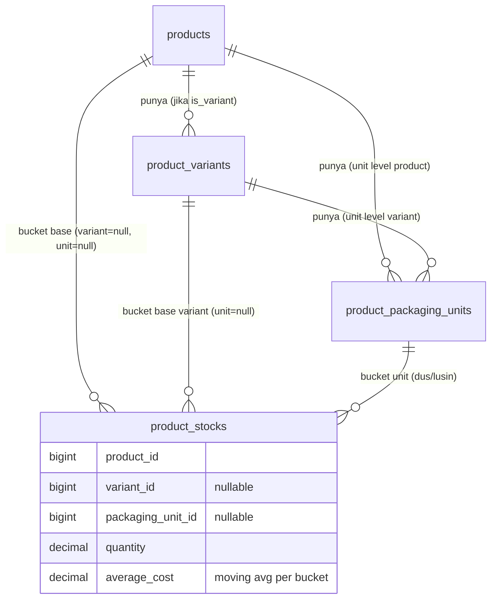
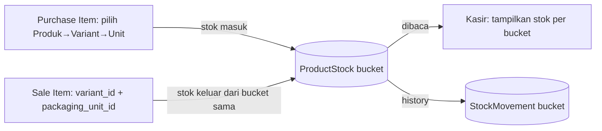

## Background (temuan riset kode)

- `ProductStock` sekarang: `product_id + store_id + branch_id` saja, unique constraint di situ.
- `PurchaseController::store()`: item pembelian cuma `product_id + quantity + cost_price`, langsung `ProductStock::firstOrCreate(['product_id', 'store_id', 'branch_id'])`.
- `KasirController::store()`: `SaleItem` sudah punya kolom `variant_id` & `packaging_unit_id` (terisi dari cart), tapi validasi stok & pengurangan stok masih query `ProductStock::where('product_id', ...)` — variant/unit-nya **diabaikan total** saat potong stok.
- `useKasir.js`: `addToCart`/`changeQty` sudah pakai `product.stock` (angka flat) buat validasi — ini juga perlu diubah jadi per-bucket.
- Model `ProductPriceTier`/`ProductPackagingUnit` sudah punya pola `variant_id` nullable + FK cascade — ini pola yang akan saya tiru untuk stock.

## Proposed Solution

Konsep "stock bucket" = `product_id + variant_id (nullable) + packaging_unit_id (nullable)`. Tiap bucket berdiri sendiri, tidak ada konversi otomatis.

Alur data (purchase → stock → kasir):

Task Breakdown (TDD, incremental, tiap task demo-able):

**Task 1: Migration + Model — `product_stocks` jadi bucket-aware**
Tambah `variant_id` (nullable FK ke `product_variants`, cascade), `packaging_unit_id` (nullable FK ke `product_packaging_units`, cascade), `average_cost` (decimal, default 0). Drop unique lama `[product_id, store_id, branch_id]`, tambah unique baru `[product_id, variant_id, packaging_unit_id, store_id, branch_id]`. Update `ProductStock.php`: fillable, casts, relasi `variant()` & `packagingUnit()`. Data lama otomatis jadi bucket base (`variant_id=NULL, packaging_unit_id=NULL`) — tidak perlu migrasi data.
Test: Pest unit test — buat `ProductStock` dengan kombinasi variant+unit berbeda untuk produk yang sama, pastikan tidak collision, pastikan bucket base lama tetap kebaca `variant_id=null`.
Demo: `php artisan tinker` tidak dipakai (sesuai rule), tapi test Pest membuktikan skema baru jalan tanpa merusak data existing.

**Task 2: Migration + Model — `stock_movements` bucket-aware**
Tambah `variant_id`, `packaging_unit_id` (nullable FK, cascade) ke `stock_movements`. Update `StockMovement.php` — fillable + relasi.
Test: assert `StockMovement::create()` dengan variant_id/packaging_unit_id tersimpan & relasinya jalan.
Demo: histori pergerakan stok kini bisa dilacak per bucket, tervalidasi via test.

**Task 3: Migration + Model — `purchase_items` bucket-aware**
Tambah `variant_id`, `packaging_unit_id` (nullable FK), `unit_name` (string nullable, buat histori/tampilan). Update `PurchaseItem.php` — fillable + relasi `variant()`, `packagingUnit()`.
Test: assert `PurchaseItem::create()` dengan variant/unit tersimpan benar.
Demo: struktur pembelian sudah siap terima input per bucket (belum wired ke controller).

**Task 4: Backend — `PurchaseController::store()` jadi bucket-aware + moving average per bucket**
Update validasi (`items.*.variant_id`, `items.*.packaging_unit_id` nullable, exists check relasi ke product yang benar). Ganti `ProductStock::firstOrCreate([...])` pakai key bucket lengkap. Pindahkan logic `updateMovingAverageCost` dari level `Product` ke level bucket (`average_cost` di `ProductStock`, hitung tertimbang per bucket, bukan lagi update `Product::cost_price`).
Test: Pest feature test — beli 10 dus (Rp48.000/dus) lalu 5 pcs (Rp2.200/pcs) untuk variant yang sama → assert 2 bucket stok terbentuk terpisah dengan `average_cost` masing-masing benar, tidak saling mencampur.
Demo: input pembelian by dus dan pcs sekaligus, cek `ProductStock` tabel — 2 baris independen dengan modal masing-masing akurat.

**Task 5: Backend — `PurchaseController::update()` / `destroy()` / `updateStatus()` konsisten bucket-aware**
Terapkan pola bucket yang sama ke 3 method lain yang juga menyentuh stok (edit draft→completed, hapus, ubah status completed↔cancelled), termasuk reverse `average_cost` saat pembatalan.
Test: Pest test — buat purchase draft dengan item bucket tertentu, ubah ke completed → stok bucket bertambah; batalkan → stok & average_cost bucket balik ke semula.
Demo: seluruh siklus hidup purchase (draft→completed→cancelled) konsisten menjaga integritas stok per bucket.

**Task 6: Backend — `KasirController::index()` kirim stok per bucket ke frontend**
Ubah query `products` — hitung stok per variant (`variant.stock`) dan per packaging unit (`packaging_unit.stock`) dari `ProductStock`, bukan cuma flat `p->stock`. Base product stock (non-variant, non-unit) tetap `p->stock` seperti sekarang untuk backward compat produk simple.
Test: Pest feature test — hit endpoint kasir index, assert response memuat stok terpisah per variant dan per packaging unit yang cocok dengan data `ProductStock`.
Demo: payload kasir sekarang membawa info stok granular per bucket, siap dipakai frontend.

**Task 7: Backend — `KasirController::store()` potong stok dari bucket yang benar**
Ganti pre-validasi stok dan deduction logic: key lookup `ProductStock` pakai `product_id + variant_id + packaging_unit_id` dari `SaleItem`, bukan cuma `product_id`. Catat `StockMovement` dengan bucket yang sama.
Test: Pest feature test — jual dus tidak mengurangi stok pcs (dan sebaliknya) untuk variant yang sama; jual variant A tidak mengurangi stok variant B.
Demo: transaksi kasir riil membuktikan pemisahan stok total akurat — ini menutup bug tersembunyi yang saya temukan di awal.

**Task 8: Frontend — Purchase Create/Edit, dropdown bertingkat Produk→Variant→Unit**
Update `resources/js/Pages/Admin/Purchases/Create.jsx` & `Edit.jsx`: per item row, kalau produk `is_variant` → muncul dropdown Variant; kalau variant/produk punya packaging units → muncul dropdown Unit. Kirim `variant_id`/`packaging_unit_id` ke payload.
Test: tidak ada test frontend otomatis di project ini (belum ada Jest/Vitest terlihat) — verifikasi manual via `npm run build` sukses tanpa error, dan Pest test Task 4 sudah menutupi backend-nya.
Demo: staf input pembelian bisa pilih persis "Kaos - Merah - Dus" atau "Kaos - Merah - Pcs" sebagai baris berbeda.

**Task 9: Frontend — `useKasir.js` + `ProductCard`/`RetailProductModal` pakai stok per bucket**
Ganti validasi stok di `addToCart`/`changeQty` — cek `variant.stock` atau `packaging_unit.stock` (dari Task 6) bukan `product.stock` flat. Tampilkan stok relevan di UI modal (misal "Stok Dus: 12" saat unit dus dipilih).
Demo: coba jual dus sampai habis — pcs varian yang sama tidak ikut kena "stok habis", karena memang bucket beda.

**Task 10: Frontend — Margin per bucket di halaman produk**
Update `ProductController::show()` (detail produk) — sertakan `average_cost` per bucket dari `ProductStock`. Tampilkan breakdown margin di halaman detail produk (Pcs vs Dus, per variant).
Test: Pest test assert response detail produk membawa data margin per bucket yang benar.
Demo: pemilik toko buka detail produk "Kaos" → lihat margin Pcs dan margin Dus terpisah, sesuai rekomendasi yang sudah disepakati.

**Task 11: Final — Pint + Build + Full Test Suite**
`vendor/bin/pint --dirty --format agent`, `npm run build`, `php artisan test --compact`. Pastikan tidak ada regresi di test lama (`VariantProductTest`, kasir, purchase existing).
Demo: seluruh test suite hijau, build frontend sukses, siap dipakai.

---

Catatan scope (sesuai kesepakatan kita): `stock_adjustment_items`, `stock_opname_items`, `stock_transfer_items`, `purchase_return` **belum** disentuh di fase ini — tetap product-level sebagai technical debt yang perlu jadi planning fase selanjutnya sebelum benar-benar dianggap "selesai", supaya tidak ada modul yang diam-diam salah baca stok bucket baru.
