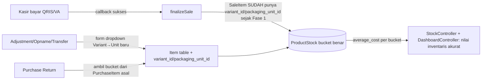

## Ruang lingkup: RETAIL SAMPAI TUNTAS

Keputusan arah: kita tidak lanjut ke FnB/Service/dll sampai **retail benar-benar selesai** — backend dan frontend, semua modul yang applicable ke tipe toko `retail`. Tidak ada penghapusan tabel/kolom database kecuali memang mengharuskan (semua migration di sini cuma nambah kolom nullable, pola sama seperti Fase 1).

Modul yang **applicable ke retail** (dari `FeatureSeeder.php`, kolom `applicable_types`) dan jadi scope dokumen ini:
`purchase`, `purchase_return`, `stock`, `batch_expired`, `stock_adjustment`, `stock_opname`, `stock_transfer`, `product`, `basic_pos` (Kasir + riwayat Penjualan), `payment_gateway`, `supplier`, `report`.

Modul yang **TIDAK applicable ke retail** (FnB/Service-only) — sengaja diskip, jangan disentuh sampai kita masuk fase FnB:
`waste`, `recipe`, `table`, `kitchen`, `queue`, `modifier`, `booking`.

---

## Background — lanjutan Fase 1

Fase 1 (`PLANNING_FLOWPRODUCTSTOK.md`) sudah menuntaskan: `PurchaseController`, `KasirController::store()` (jalur cash), `KasirController::index()`, form Purchase Create/Edit, POS frontend, margin per bucket di halaman produk. Semua sudah bucket-aware (`product_id + variant_id + packaging_unit_id`).

Audit lanjutan menemukan modul lain yang masih pakai key lama (`product_id + store_id` saja) atau masih baca `Product::cost_price` yang sudah usang sejak modal per bucket dipindah ke `ProductStock.average_cost`:

| # | File | Masalah | Dampak ke retail |
|---|------|---------|-------------------|
| 1 | `PaymentGatewayController::finalizeSale()` | Potong stok tanpa `variant_id`/`packaging_unit_id` | 🔴 **Kritis** — jalur produksi aktif, tiap pembayaran QRIS/VA sukses |
| 2 | `StockAdjustmentController` (`quickStore`, `updateStatus`) | Sama + update `Product::cost_price` bukan bucket `average_cost` | 🟠 Tinggi — dipakai dari halaman detail produk |
| 3 | `StockOpnameController::updateStatus()` | Key `ProductStock` tidak lengkap | 🟡 Sedang |
| 4 | `StockTransferController::updateStatus()` | Key tidak lengkap, **dan** stok sebenarnya tidak pernah pindah (cuma catat `StockMovement`, `ProductStock` tidak diubah) — bug lama, bukan akibat bucket | 🟡 Sedang, 2 bug jadi 1 perbaikan |
| 5 | `PurchaseReturnController::adjustStock()` | Key tidak lengkap, padahal `purchase_item_id` sudah tersedia buat ambil bucket asli | 🟡 Sedang |
| 6 | `StockController::index()` (`total_value`), `DashboardController` (`inventory_value`) | Hitung nilai stok pakai `product.cost_price` yang sudah usang untuk produk dengan variant — seharusnya pakai `ProductStock.average_cost` per bucket | 🟠 Tinggi — angka yang salah tampil ke owner |
| 7 | `SaleController` | Terlalu banyak kewenangan (create/edit/void) untuk modul yang seharusnya jadi history read-only | Keputusan produk, bukan bug |

`WasteController` sengaja **tidak** masuk tabel di atas — itu FnB-only, di luar scope dokumen ini.

## Proposed Solution

Pola konsisten dengan Fase 1: tambah `variant_id` + `packaging_unit_id` (nullable FK, cascade) ke item table yang belum punya, lalu setiap controller yang baca/tulis `ProductStock` diubah key-nya jadi lengkap. Untuk isu pelaporan (#6), ganti sumber data dari `product.cost_price` ke `ProductStock.average_cost`.

---

## Task Breakdown (TDD, incremental, urut eksekusi)

**Task 1 — `PaymentGatewayController::finalizeSale()` bucket-aware**
File: `app/Http/Controllers/Admin/PaymentGatewayController.php`
Ganti `ProductStock::firstOrCreate(['product_id' => X, 'store_id' => Y])` di `finalizeSale()` jadi include `$item->variant_id` dan `$item->packaging_unit_id` (kolom ini sudah ada di `SaleItem` sejak Fase 1 — tidak perlu migration). Cabang resep (raw material) tetap product-level, tidak berubah.
Test baru: `tests/Feature/PaymentGatewayBucketStockTest.php` — buat Sale status pending + SaleItem bervariant/unit, panggil `finalizeSale()`, assert bucket yang benar berkurang, bucket lain tidak tersentuh.
Demo: transaksi QRIS untuk produk bervariant, stok yang berkurang adalah bucket yang benar.

**Task 2 — Migration: `variant_id` + `packaging_unit_id` ke 4 item table**
File baru: 4 migration di `database/migrations/`, ditambahkan ke:
- `stock_adjustment_items` (model: `app/Models/StockAdjustmentItem.php`)
- `stock_opname_items` (model: `app/Models/StockOpnameItem.php`)
- `stock_transfer_items` (model: `app/Models/StockTransferItem.php`)
- `purchase_return_items` (model: `app/Models/PurchaseReturnItem.php`)
Pola migration identik Fase 1 Task 1-3 (FK nullable, cascade). Update `fillable` + relasi `variant()`/`packagingUnit()` di 4 model itu.
Test baru: 1 file per model, assert `create()` dengan bucket tersimpan & bucket lama (`null`) tetap terbaca — pola sama `ProductStockBucketTest.php` Fase 1.
Demo: skema siap, belum wired ke controller/frontend.

**Task 3 — `StockAdjustmentController` bucket-aware + benerin `cost_price`**
File: `app/Http/Controllers/Admin/StockAdjustmentController.php`, `resources/js/Pages/Admin/Stock/Adjustment/Create.jsx`, `resources/js/Pages/Admin/Products/QuickStockModal.jsx`
- `store()` terima `items.*.variant_id`/`items.*.packaging_unit_id`, simpan ke `StockAdjustmentItem`
- `updateStatus()` dan `quickStore()` ganti key `ProductStock` jadi lengkap
- `quickStore()` update `average_cost` di bucket `ProductStock`, **bukan** lagi `Product::cost_price`
- `QuickStockModal.jsx` kirim `variant_id`/`packaging_unit_id` kalau produk punya variant (dropdown baru, pola `ProductCombobox` Fase 1)
Test baru: `tests/Feature/StockAdjustmentBucketTest.php` — quick adjustment bucket tertentu tidak pengaruhi bucket lain; `average_cost` bucket ter-update benar bukan `Product::cost_price`.
Demo: penyesuaian stok cepat maupun draft akurat per bucket, modal ikut ter-update di tempat yang benar.

**Task 4 — `StockOpnameController` bucket-aware**
File: `app/Http/Controllers/Admin/StockOpnameController.php`, `resources/js/Pages/Admin/Stock/Opname/Create.jsx`
Sama pola Task 3 (tanpa isu cost_price — opname tidak pernah nyentuh cost_price). Form Create perlu list semua bucket existing per produk, bukan cuma produk.
Test baru: `tests/Feature/StockOpnameBucketTest.php`.
Demo: opname mengoreksi stok per bucket, bukan cuma per produk.

**Task 5 — `StockTransferController` bucket-aware + perbaiki bug stok tidak pindah**
File: `app/Http/Controllers/Admin/StockTransferController.php`, `resources/js/Pages/Admin/Stock/Transfer/Create.jsx`
Dua perbaikan sekaligus: (a) `updateStatus()` saat `received` — sekarang **harus** `decrement` stok bucket di `from_branch_id` dan `increment` di `to_branch_id` (saat ini cuma catat `StockMovement` tanpa efek nyata); (b) key `ProductStock` lengkap dengan bucket.
Test baru: `tests/Feature/StockTransferBucketTest.php` — assert stok cabang asal BERKURANG (sebelumnya tidak terjadi sama sekali) dan cabang tujuan BERTAMBAH, bucket lain di kedua cabang tidak berubah.
Demo: transfer antar cabang benar-benar memindahkan stok, per bucket yang tepat.

**Task 6 — `PurchaseReturnController` bucket-aware**
File: `app/Http/Controllers/Admin/PurchaseReturnController.php`
`purchase_item_id` sudah dikirim dari frontend — load relasi `PurchaseItem` dan pakai `variant_id`/`packaging_unit_id`-nya sebagai key `ProductStock`. Tidak perlu dropdown baru di form; cukup tampilkan label bucket (mis. "Merah - Dus") di daftar item retur.
Test baru: `tests/Feature/PurchaseReturnBucketTest.php` — retur bucket dus mengurangi stok+reverse `average_cost` bucket dus saja.
Demo: retur ke supplier terkoreksi di bucket yang tepat, modal ikut konsisten.

**Task 7 — Akurasi laporan nilai inventaris (pakai `average_cost` bucket)**
File: `app/Http/Controllers/Admin/StockController.php` (method `index()`), `app/Http/Controllers/Admin/DashboardController.php` (`inventoryValue`)
Ganti `$s->product->cost_price` jadi `$s->average_cost` (langsung dari bucket `ProductStock`, tidak perlu join lagi). Sekalian benerin `total_products` di `StockController::index()` yang sekarang menghitung jumlah **baris bucket**, bukan jumlah produk unik — perlu `distinct('product_id')->count()` terpisah.
Test baru: `tests/Feature/StockValueAccuracyTest.php` — assert nilai inventaris dihitung dari `average_cost` bucket, dan `total_products` menghitung produk unik meski 1 produk punya banyak bucket.
Demo: dashboard & halaman stok tampilkan nilai inventaris yang akurat untuk produk bervariant/multi-satuan.

**Task 8 — `SaleController` dipangkas jadi history read-only + `destroy` owner-only**
File: `app/Http/Controllers/Admin/SaleController.php`, `routes/web.php`, `database/seeders/DatabaseSeeder/PermissionSeeder.php`, `app/Services/StoreRoleService.php`, `resources/js/Pages/Admin/Sales/Index.jsx`
- **Dihapus** (method + route): `create`, `store`, `switchPayment`, `updateStatus` (void/cancel)
- **Dipertahankan**: `index`, `show`, `print`
- **`destroy`**: tetap ada tapi owner-only — tambah permission baru `sale.delete`, di-assign **hanya** ke role `owner` (yang otomatis dapat semua permission lewat wildcard `'*'` di `StoreRoleService`, jadi tidak perlu ubah role lain). Ganti middleware route `destroy` dari `permission:sale.void` jadi `permission:sale.delete`.
- 5 endpoint lifecycle (`updateServiceStatus`, `updateRentalStatus`, `checkOutHospitality`, `exitParking`, `endSession`) — **tidak disentuh**, itu untuk tipe toko lain (service/rental/hospitality/parking/session), tidak relevan untuk retail dan tidak masuk kategori "edit transaksi" yang dimaksud.
- Frontend: hapus tombol "+ Tambah" dan link ke `sales.create` di `Sales/Index.jsx`. File `resources/js/Pages/Admin/Sales/Create.jsx` jadi dead code — boleh dihapus (ini file kode, bukan tabel/kolom DB, aman dihapus) atau dibiarkan tidak terpakai, sesuai preferensi kamu saat eksekusi.
Test baru: `tests/Feature/SalesHistoryOnlyTest.php` — assert route `sales.create`/`sales.store`/`sales.switchPayment`/`sales.updateStatus` sudah tidak terdaftar (404), `sales.destroy` gagal untuk role non-owner (403) dan berhasil untuk owner.
Demo: menu Penjualan jadi murni riwayat transaksi, satu-satunya jalur bikin transaksi baru adalah Kasir POS.

**Task 9 — Final: Pint + Build + Full Test Suite**
`vendor/bin/pint --dirty --format agent`, `npm run build`, `php artisan test --compact`. Pastikan tidak ada regresi di test Fase 1 maupun test lama lainnya (`VariantProductTest`, `KasirStockValidationTest`, dll).
Demo: seluruh test suite hijau — retail flow (purchase, kasir cash+PG, adjustment, opname, transfer, retur, laporan, riwayat penjualan) benar-benar solid sebelum lanjut ke FnB.

---

## Urutan eksekusi

Tidak ada yang didahulukan secara khusus di luar urutan Task 1→9 di atas — Task 1 tetap paling awal karena itu satu-satunya yang bug produksi aktif (jalur pembayaran non-tunai). Task 2 wajib sebelum Task 3-6 (migration duluan). Task 7 dan 8 independen, bisa dikerjakan kapan saja setelah Task 1-6, urutannya tidak kritis.

## Setelah Fase 2 selesai

Baru lanjut ke planning fase FnB — modul `waste`, `recipe`, `table`, `kitchen`, `modifier`, `queue`, `booking` — yang belum disentuh sama sekali di dua fase ini.
